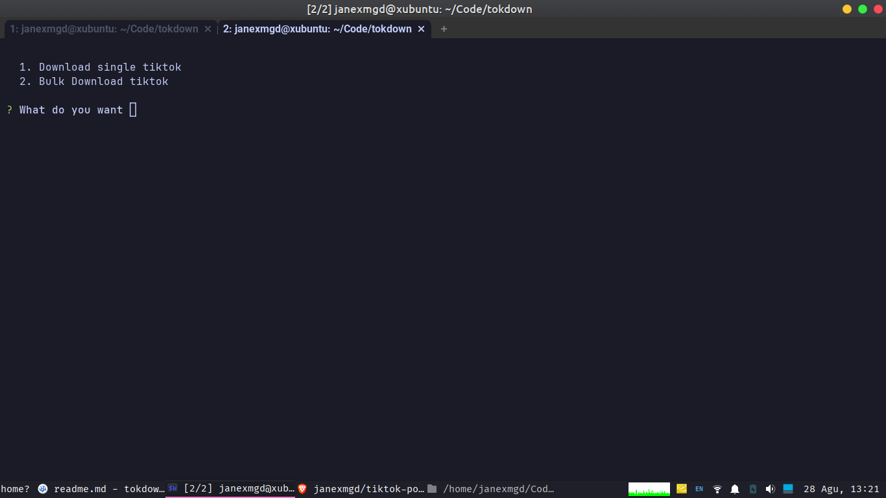

<a name="readme-top"></a>
<a name="readme-top"></a>

<!-- PROJECT LOGO -->
<br />
<div align="center">
  <h1 align="center"><font size="6">tiktok-post-dl</font></h1>

  <p align="center">
  An javascript project to download media from a post in tiktok
    <br />
    <a href="https://github.com/janexmgd/tiktok-post-dl"><strong>Explore the docs »</strong></a>
  </p>
</div>
<!-- TABLE OF CONTENTS -->
<details>
  <summary>Table of Contents</summary>
  <ol>
    <li>
      <a href="#about-the-project">About The Project</a>
      <ul>
        <li><a href="#built-with">Built With</a></li>
      </ul>
    </li>
      <a href="#getting-started">Getting Started</a>
    </li>
    <li>
      <a href="#how-to-run">How to run</a>
    </li>
    <li><a href="#get-all-post-url-from-profile">Get all post url from profile</a></li>
  </ol>
</details>

<!-- ABOUT THE PROJECT -->

## About The Project



This project is about developing tools for downloading media from tiktok post using Node.js. This tool is designed to provide an efficient solution for downloading a large number of files at once.

<p align="right">(<a href="#readme-top">back to top</a>)</p>

### Built With


<p align="right">(<a href="#readme-top">back to top</a>)</p>

<!-- GETTING STARTED -->

### Getting Started

1. Make sure you have the latest Node.js installed. (I'm using node js 19.9.0)
2. Clone this repository to your machine.
3. Install the dependencies

- npm
  ```sh
  npm install
  ```
  <p align="right">(<a href="#readme-top">back to top</a>)</p>

<!-- How to run -->

### How To Run

1.start the project locally

```sh
 npm start
```

2.follow instructions

<!-- Get all post url from profile -->

### Get all post url from profile

thx to thread at https://stackoverflow.com/questions/59690743/scraping-all-videos-from-a-tiktok-profile

You can use this [tampermonkey script](https://github.com/janexmgd/tampermonkey-scripts) (bug at slow network maybe)

or using this

1. Open the target tiktok profile
2. Open console menu at your broswer(Iam using brave broswer at Xubuntu) and copy this code

```js
let goToBottom = setInterval(() => window.scrollBy(0, 400), 1000);
```

3. Wait until scrool done, after scrool done copy this code to the console like step 2

```js
setTimeout(() => {
  clearInterval(goToBottom);
  console.log('Finished scrolling. Starting to extract video links...');
  let arrayVideos = [];
  const containers = document.querySelectorAll(
    '[class*="-DivItemContainerV2"]'
  );
  for (const container of containers) {
    const link = container.querySelector('[data-e2e="user-post-item"] a');
    if (link && link.href) {
      arrayVideos.push(link.href);
    }
  }

  console.log('Video links extracted:', arrayVideos);

  const blob = new Blob([arrayVideos.join('\n')], { type: 'text/plain' });
  const a = document.createElement('a');
  a.href = URL.createObjectURL(blob);
  a.download = 'video_links.txt';
  document.body.appendChild(a);
  a.click();
  document.body.removeChild(a);
  console.log('File downloaded as video_links.txt');
}, 30000);
```

<p align="right">(<a href="#readme-top">back to top</a>)</p>

<!-- NOTES -->

### Notes

im run at ubuntu 22.04 jammy, im dont test at windows lmao

put your list at currentfilepath/list

The file downloaded will saved at currentfilepath/media/yourfoldername

<br>

<p align="right">(<a href="#readme-top">back to top</a>)</p>
